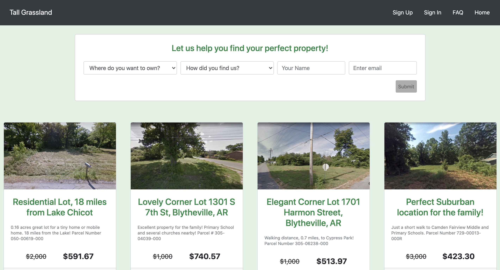
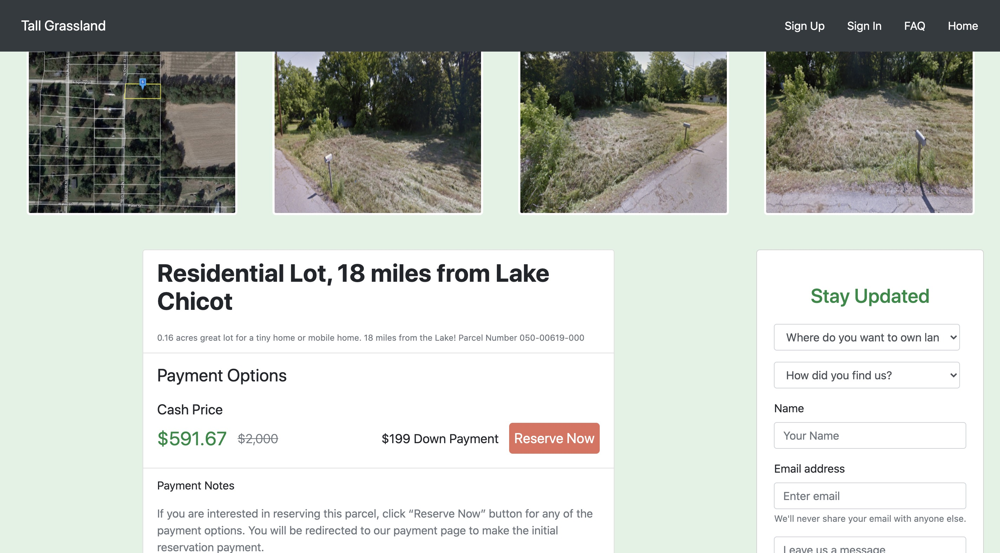

# Tall Grassland

Real estate land selling website. Built to replace a website that I was paying yearly for. This site is currently live at https://tallgrassland.com  

## Technology used
- React (React Router, React Hooks, ES 6)
- Redux
- Google Firebase (Authentication, Firestore, Storage)
- Bootstrap
- CSS (responsive design, BEM naming convention & CSS Variables)

## Project Screen Shots

## Reflection

Created Tall Grassland website after being tired of updating content in wordpress and also tired of paying someone else for a website that I could build on my own. 

Feeling the need to tackle React-Redux, this is the first project where I have implemented React-Redux. My knowledge has grown exponentially with this project, because every step needed further research inorder to overcome the task at hand. Something I felt was going to be straight forward like adding pictures, was not as easy as I thought, but I was able to incorporate react hooks and firebase storage.  

In the future I will come back to add a fullstack website with stripe integration.  

## Available Scripts
This project was bootstrapped with [Create React App](https://github.com/facebook/create-react-app).

In the project directory, you can run:

### `npm run start`

Runs the app in the development mode. 
Open [http://localhost:3000](http://localhost:3000) to view it in the browser.

The page will reload if you make edits. 
You will also see any lint errors in the console.

### `npm run test`
Launches the test runner in the interactive watch mode. 
See the section about running tests for more information.

### `npm run build`

Builds the app for production to the `build` folder. 
It correctly bundles React in production mode and optimizes the build for the best performance.

The build is minified and the filenames include the hashes. 
Your app is ready to be deployed!

### `npm run eject`

Note: this is a one-way operation. Once you eject, you can’t go back! 

If you aren’t satisfied with the build tool and configuration choices, you can eject at  any time. This command will remove the single build dependency from your project.  

Instead, it will copy all the configuration files and the transitive dependencies  (Webpack, Babel, ESLint, etc) right into your project so you have full control over  them. All of the commands except eject will still work, but they will point to the  copied scripts so you can tweak them. At this point you’re on your own.  

You don’t have to ever use eject. The curated feature set is suitable for small and  middle deployments, and you shouldn’t feel obligated to use this feature. However we  understand that this tool wouldn’t be useful if you couldn’t customize it when  you are ready for it.  
